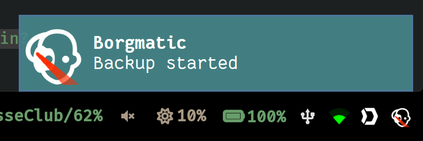

# Traycortex

Tray icon for borgmatic.

**(Early work in Progress.)**

traycortex is an application that will show the status of [borgmatic
backup](https://torsion.org/borgmatic/) in your system tray.

Along with it comes a traycortex-cli application, that is used in the borgmatic
hooks configuration to signal the tray icon. Currently the only states that are
implemented are "job_started" and "job_finished".

When the status of a backup is updated, a notification will be displayed and the
icon changes accordingly.

## Installation

### Prerequites

Some packages are required to build and install traycortex (probably incomplete):

  - Ubuntu: `apt install libcairo2-dev python-gi-dev libgirepository1.0-dev`
  - Arch: `pacman -S gobject-introspection python-cairo libappindicator-gtk3`

Recommended way to install:

    pipx install traycortex

Also works:

    pip install traycortex

*Packagers welcome*

## Configuration File

Location: `$XDG_CONFIG_HOME/traycortex.ini`

Currently the only configuration that is possible is the authkey that is used
to authenticate the connection between *traycortex* and *traycortex-cli*

Example:

    [connection]
    authkey = ce03f7af891ebc29defc0643faf71025

To create a working minimal configuration (if you do not have one already) use:

    traycortex-cli --ini

This will generate a random authkey and place it in a new configuration file.
If a configuration file already exists, above command will fail.

## Integrating with borgmatic

Example `~/.config/borgmatic.d/home.yaml`:

    [...]
    source_directories:
        - /home/seb
    repositories:
        - path: ssh://...
    before_backup:
        - traycortex-cli job_started
    after_check:
        - traycortex-cli job_finished
    [...]

## Running

To start the tray application:

    traycortex &

Other methods of starting will be investigated (.desktop file, systemd user unit)
